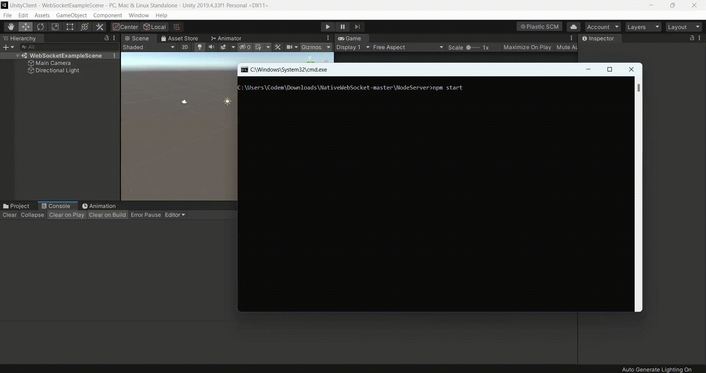

# Unity Websocket Client 

This is the simplest WebSocket library for Unity without using any external DLL's.



## Installation

*Requires Unity 2019.4+ with .NET 4.x+ Runtime*

### Client side (Unity3D)
**1.** [Download the project](https://github.com/codemaker2015/UnityWebsocketClient/archive/master.zip)
**2.** Open UnityClient folder in the UnityHub


## Usage

```csharp
using UnityEngine;
using NativeWebSocket;

public class Connection : MonoBehaviour
{
    WebSocket websocket;

    // Start is called before the first frame update
    async void Start()
    {
        websocket = new WebSocket("ws://localhost:3000");

        websocket.OnOpen += () =>
        {
            Debug.Log("Connected!");
        };

        websocket.OnError += (e) =>
        {
            Debug.Log("Error! " + e);
        };

        websocket.OnClose += (e) =>
        {
            Debug.Log("Disconnected");
        };

        websocket.OnMessage += (bytes) =>
        {
            Debug.Log("Server: " + System.Text.Encoding.UTF8.GetString(bytes));
        };

        // Keep sending messages at every 0.3s
        InvokeRepeating("SendWebSocketMessage", 0.0f, 0.3f);

        // waiting for messages
        await websocket.Connect();
    }

    void Update()
    {
#if !UNITY_WEBGL || UNITY_EDITOR
        websocket.DispatchMessageQueue();
#endif
    }

    async void SendWebSocketMessage()
    {
        if (websocket.State == WebSocketState.Open)
        {
            await websocket.SendText("hello world");
        }
    }

    private async void OnApplicationQuit()
    {
        await websocket.Close();
    }

}
```

**3.** Open the `NativeWebSocket/Assets/Samples/WebSocketExampleScene.unity` on Unity and Run.


# Server side (Node.js)

**1.** [Download the project](https://github.com/codemaker2015/UnityWebsocketClient/archive/master.zip) and switch to the NodeServer directory

```
cd NodeServer
```

**2.** Install the dependencies

```
npm install
```

**3.** Start the local WebSocket server

```
npm start
```
